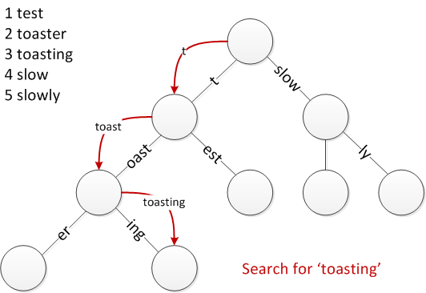

# RadixTree

A package for generating [radix trees](https://en.wikipedia.org/wiki/Radix_tree), also called compressed tries.

<p align="center">
  
  <p>Source: <a href="https://en.wikipedia.org/wiki/Radix_tree">en.wikipedia.org/wiki/Radix_tree</a>.</p>
</p>

In a radix tree each node represents a prefix that can be merged with all its parents to produce a string.
This is an efficient, space optimised way to store strings.
This allows for `O(log(n))` search time through a list of strings.
The main applications are for IP addresses and in [inverted indexes](https://www.algolia.com/blog/engineering/inside-the-algolia-engine-part-2-the-indexing-challenge-of-instant-search/) for information retrieval.
They can also be used for predictive text and DNA sequences.

This package also comes with a simple `find_n_larger` that uses binary search to search through a sorted linear list.
This also runs in `O(log(n))` time and sets a competitive baseline.

See also:
- The `Trie` struct in [DataStructures.jl](https://juliacollections.github.io/DataStructures.jl/stable/trie/)

## Usage

```julia
root = RadixTreeNode("<root>")
insert!(root, "t")
insert!(root, "ten")
insert!(root, "team")
insert!(root, "tea")
print_tree(root)
```

The output:
```
<root>
|--t
|--|--e
|--|--|--a
|--|--|--|--m
|--|--|--n
```

The `get` command will find the deepest node in the tree that matches the `key`.
It also returns the number of matched letters:
```julia
get(root, "team") # (RadixTreeNode{String}(data=m, is_label=true, children=String[]), 4)
get(root, "te") # (RadixTreeNode{String}(data=e, is_label=false, children=["a", "n"]), 2)
get(root, "x") # (RadixTreeNode{String}(data=<root>, is_label=false, children=["t"]), 0)
```

## Worked example

Find a large list of Engish words e.g [link](https://www.mit.edu/~ecprice/wordlist.10000). Load them:
```julia
using RadixTree

tree = RadixTreeNode()
filepath = "mit_words.txt"
open(filepath, "r") do f
    for line in eachline(f)
        insert!(tree, line)
    end
end
```

Find the height and size of the tree:
```julia
get_height(tree) # 11
Base.summarysize(tree) # 978170 B = 0.93 MB
```

Find words that start with "insi":
```julia
get_n_larger(tree, "insi", 5) # [inside, insider, insight, insights]
```

Compare with a binary search through a linear word list:
```julia
using RadixTree: find_n_larger
words = sort(readlines(filepath))
@time find_n_larger(words, "tre", 5); # 0.000010 seconds (2 allocations: 128 bytes)
@time get_n_larger(tree, "tre", 5);   # 0.000051 seconds (37 allocations: 1.359 KiB)
```

For this case the binary search is faster.

Print the tree to a file:
```julia
open("tree.txt", "w") do f
    print_tree(f, tree; use_data_as_separator=true)
end
```

## Reference

List of available methods:
- `RadixTreeNode`
- add: `insert!`
- get: `get`, `get_n_larger`, `in`
- children: `children`, `children_data`
- describe: `eltype`, `get_height`
- traverse: `PreOrderTraversal`, `iterate`
- show: `print_tree`

## Installation

Download the GitHub repository (it is not registered). Then in the Julia REPL:
```
julia> ] # enter package mode
(@v1.x) pkg> dev path\\to\\RadixTree.jl
julia> using Revise # for dynamic editing of code
julia> using RadixTree
```
